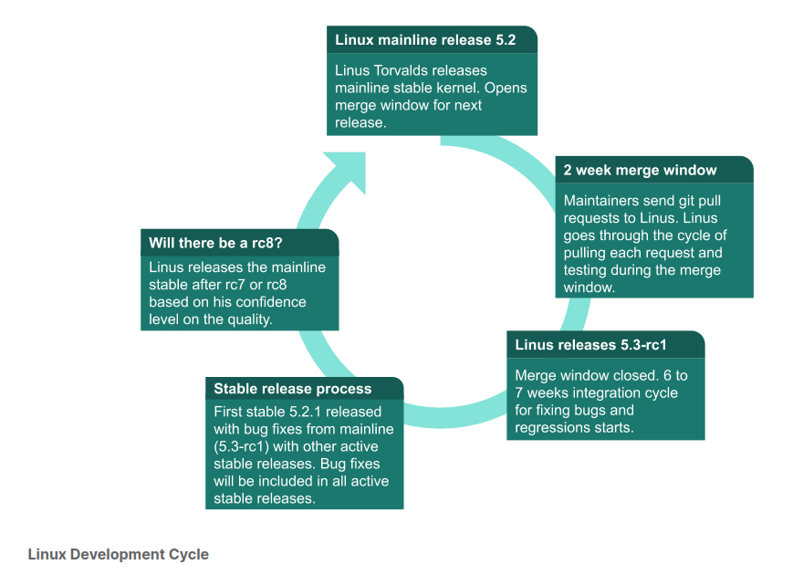
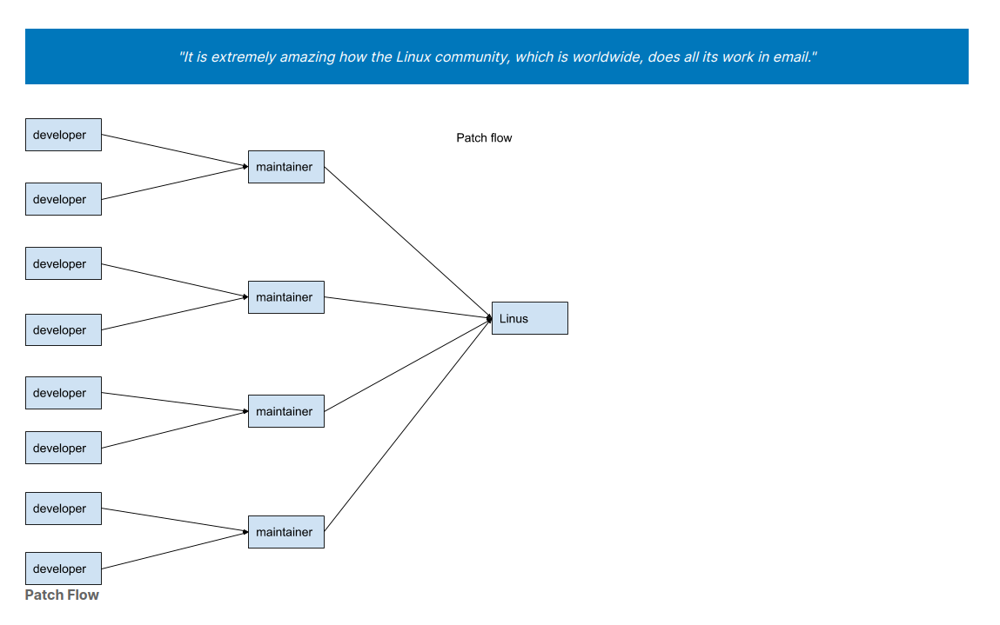

## About the Linux Kernel


<br />

> - The `Linux Kernel` is the result of collaborative development efforts from developers
    across the globe.

> - Small incremental changes, also known as `patches`, add new features, make
    enhancements, and fix bugs.

> - It is a 24-hour, seven days a week, and 365 days of continuous development process
    that results in a new release once every 2+ months, and several stable and extended
    stable releases once a week. New development and current release integration cycles
    run in parallel.

> - A new release comes out once a every 10 to 11 weeks. Releases are time-based rather
    than feature-based. That means releases are not held up for features. There is no
    set date for these releases.

<br />
<br />


## What Does the Release Cycle Look Like?
> - While the kernel development is a continuous process, at certain points during the
    development, when a set of features and bug fixes are ready, a new version of the
    kernel is released.

> - These new version are called `kernel releases`.

> - Linus Torvalds releases a new kernel and opens 2-week merge window.

> - During this merge window, he pulls code for the next release from subsystem
    maintainers.

> - Subsystem maintainers send signed git pull requests to Linux either during the
    merge window or before.

> - All major new development is added to the kernel during the merge window.

> - 10,000+ change sets (patches) get pulled into Linus's tree during these 2 weeks,
    at the end of which he releases the first release candidate, known as `rc1`.

> - At this point, the release cycle moves into a bug fixes-only mode, with a series
    of `release candidate (rc)` releases from Linus.

> - One week after `rc1` is released, `rc2` comes out; `rc3` comes out a week after,
    and so on, until all major bug fixes and regressions (if any) are resolved.

> - The new cycle begins with a 3-week `quiet period`, which starts a week before the
    release, and continues through the 2-week merge window.

> - Maintainers and key contributors are busy getting their trees ready to send pull
    requests to Linus.

> - Please notee that the quiet period isn't formalized, and each sub-system might
    handle it differently.

> - This period isn'tt well advertised, and new developers might see a slow response
    from the community.



<br />
<br />


## Active Kernel Releases
```plaintext
Release Candidate (RC)
    - Release Candidate or RC releases are mainline kernel pre-releases that are used
      for testing new features in the mainline.
    - These releases must be compiled from source.
    - Kernel developers test these releases for bugs and regressions.

Stable
    - Stable releases are bug fix-only releases.
    - After Linus releases a mainline kernel, it moves into stable mode.
    - Any bug fixes for a stable kernel are backported from the mainline kernel and
      applied to stable git by a designated stable kernel release maintainer.
    - Stable kernel updates are released on average, once a week, or on an as needed
      basis.

Long-term
    - Long-term releases are stable releases selected for long-term maintenance to
      provide critical bug fixes for older kernel trees.
```

> - Stable releases are normally only maintained for a few mainline release cycles,
    unless they are marked as long-term releases (LTR).

> - A long-term release, as the name suggests, is maintained for a longer period
    to allow multiple vendors collaborate on a specific kernel release that they
    plan on maintaining for an extended period of time.

> - You can refer to the `Linux Kernel Archives` for more details about current stable
    and long-term release, and their release cadence.

```bash
https://www.kernel.org/category/releases.html
```

<br />
<br />


## Kernel Trees - What Are They?
> - You have probably heard about `kernel trees`; and we have already mentioned the term in
    previous pages.

> - The kernel code is organized in several main and subsystem git repositories called `trees`.

```plaintext
Kernel Trees
    The Mainline Kernel Tree
        - This tree is maintained by Linus Torvalds.
        - This is where Linus releases mainline kernels and RC releases.

    The Stable Tree
        - This tree is maintained by Greg Kroah-Hartman.
        - This tree consists of stable release branches.
        - Stable releases are based on this tree.

    The Linux-next Tree
        - This is the integration tree maintained by Stephen Rothwell.
        - Code from a large number of subsystem trees gets pulled into this tree periodically
          and then released for integration testing.
        - The process of pulling changes from various trees catches merge conflicts (if any)
          between trees.
```

> - One of my first actions as a maintainer was to request that my tree be added to
    linux-next.

> - After I commit patches to my tree, I wait 3 to 7 days before sending a pull request to
    Linus, giving enough time to find problems and regressions, if any.

> - Patches applied to a tree that will be added to `linux-next` are only for the next merge
    window, including during the merge window.

> - Patches for the next release may be added to `linux-next` after the merge window has
    closed, and the `rc1` candidate has been released by Linus.

<br />
<br />


## Subsystem Maintainers
> - Each major subsystem has its own tree and designated maintainer(s).

> - Subsystems may have multiple maintainers.

> - You can find a list of subsystem and their maintainers in the `MAINTAINERS file` in the
    kernel source.

```bash
https://www.kernel.org/doc/linux/MAINTAINERS
```

> - In addition, almost every kernel subsystem has a mailing list.

> - Please refer to the `Linux Kernel Mailing Lists` and the `List Archives on lore.kernel.org`
    for a list of mailing lists and their archives.

```bash
Linux Kernel Mailing Lists: http://vger.kernel.org/vger-lists.html
List Archives on lore.kernel.org: https://lore.kernel.org/lists.html
```

> - Archives are a great reference for patch discussions and history of changes.

> - The development process itself happens entirely over emails.

> - Contributors send patches to mailing lists through email, and contributions are then
    discussed through emails.

> - Most maintainers send an email response to contributors saying `Applied to tree-name` or
    `Thanks Applied` to contributors when they accept and commit patches.

> - Some maintainers have a bot that will send patch applied notifications with the patch
    included in them.

> - Please refer to the `kernel.org git repositories` for a list of kernel trees.

```bash
kernel.org: https://git.kernel.org/
```

> - Not all trees are on `kernel.org`.

> - You can find subsystem git information and mailing lists for each of the subsystems in
    the `MAINTAINERS file`.

> - You can refer to `A guide to the Kernel Development Process` for additional information.

```bash
Kernel Development Process Guide: https://www.kernel.org/doc/html/latest/process/development-process.html
```

> - Below is a new developer observed:



