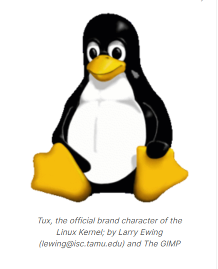

## About the Linux Kernel

 

> - The `Linux Kernel` is the result of collaborative development efforts from developers
    across the globe.

> - Small incremental changes, also known as `patches`, add new features, make
    enhancements, and fix bugs.

> - It is a 24-hour, seven days a week, and 365 days of continuous development process
    that results in a new release once every 2+ months, and several stable and extended
    stable releases once a week. New development and current release integration cycles
    run in parallel.

> - A new release comes out once a every 10 to 11 weeks. Releases are time-based rather
    than feature-based. That means releases are not held up for features. There is no
    set date for these releases.

 
 

## What Does the Release Cycle Look Like?
> - While the kernel development is a continuous process, at certain points during the
    development, when a set of features and bug fixes are ready, a new version of the
    kernel is released.

> - These new version are called `kernel releases`.

> - Linus Torvalds releases a new kernel and opens 2-week merge window.

> - During this merge window, he pulls code for the next release from subsystem
    maintainers.

> - Subsystem maintainers send signed git pull requests to Linux either during the
    merge window or before.

> - All major new development is added to the kernel during the merge window.

> - 10,000+ change sets (patches) get pulled into Linus's tree during these 2 weeks,
    at the end of which he releases the first release candidate, known as `rc1`.

> - At this point, the release cycle moves into a bug fixes-only mode, with a series
    of `release candidate (rc)` releases from Linus.

> - One week after `rc1` is released, `rc2` comes out; `rc3` comes out a week after,
    and so on, until all major bug fixes and regressions (if any) are resolved.

> - The new cycle begins with a 3-week `quiet period`, which starts a week before the
    release, and continues through the 2-week merge window.

> - Maintainers and key contributors are busy getting their trees ready to send pull
    requests to Linus.

> - Please notee that the quiet period isn't formalized, and each sub-system might
    handle it differently.

> - This period isn'tt well advertised, and new developers might see a slow response
    from the community.

