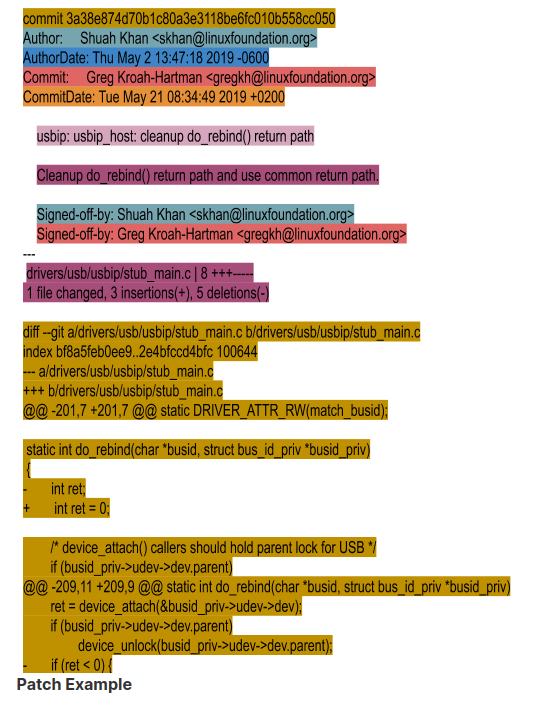

### ABOUT PATCHES
#
> - Linux kernel development is done using git, which was started by Linus Torvalds
    and is currently maintained by Junio C. Hamano.

> - To learn more about git, you can read [A short History of Git](https://git-scm.com/book/en/v2/Getting-Started-A-Short-History-of-Git) and the [Git Book](https://git-scm.com/book/en/v2) for
    details on how to use git.

> - The first three chapters of the Git Book provide the basics on how to get commit
    history, working with remotes, creating branches, tags, and rebasing to tagged
    versions.

> - These are essential survival skills, necessary for any developer.

> - Developers send changes they want to see in the kernel to the kernel mailing lists
    through email.

> - These changes are called `patches`.

> - Patches are small incremental changes made to the kernel.

> - Each patch contains a change to the kernel that implements one independent
    modification that stands on its own.

> - A patch cannot break the kernel build.

> - Requiring each patch to do one thing makes it easier to isolate regressions;
    reverting a problem patch becomes easier as well.

> - Complex changes to the kernel are thus split into smaller chunks.

> - As an example, if you were to find an existing compile warning while making a
    code change, you would fix it independently in a separate patch instead of
    combining it with your code change.

> - Maintainers have their personal preferences on how granular the patch splitting
    should be for their subsystems.

> - This is true for coding styles as well.

> - Maintainers are good about giving feedback on their preferences during the patch
    review.

<br />
<br />


### What IS IN A PATCH
#
> - You can take a look at a real commit on the next page.

> - In the screenshot we highlighted individual components, and we will walk through
    these individual components as well. We used:

```bash
git format-patch -1 --pretty=fuller 3a38e874d70b
```

> - To generate the patch you will see on the next patch and get the complete
    information about this patch.

<br />



<br />

```plaintext
Patch Components
    Commit ID
        - The auto-generated SHA 1 hash is generated from a cryptographic hash function
          that has all the important information about the patch, such as the commit
          date, the committer's name and email address, the log message, and more.
        - Changing any of the information associated with the Commit ID results in
          changing it.
        - This makes it a tamperproof fast way to compare two commits using the IDs, and
          git pull requests become fast and efficient.

    Commit Header
        "major subsystem: minor area: short description of what is being changed"
        "usbip: usbip_host: cleanup() do_rebind() return path"

        - As you can see in the image provided above, the patch changes the "usbip_host"
          driver, which is a sub-driver of the "usbip" driver.
        - This driver falls under the drivers/usb subsystem.
        - The author of the patch writes this information in a standard format with ":"
          separating the major and minor subsystem fields.
        - You will also see "/" as a separator, which would look like
          "usbip/usbip_host: cleanup do_rebind() return path" instead of
          "usbip: usbip_host: cleanup do_rebind() return path".
        - Using "/" or ":" is determined by the maintainer's preference. If in doubt,
          refer to a few patches for the subsystem for information on individual preferences.

    Commit Log
        - It provides a detailed description of the change and why the change is made.
        - Alternate design choices if any are considered.
        - Detailed about the testing done.
        - The example we provided shows a small change and the commit log is simple and to
          the point.
        - Commit logs can be long for patches that fix panics, as they include panic stack
          traces.
        - We encourage you to take a look at a few commit logs in the kernel source
          repository to get a better understanding of the kind of information that is relevant
          to include in them.

    Author
        - This componennt provides the author's name and email information.
        - This information can be specified when you run "git commit" or it can be configured
          in your ".gitconfig" file, which is a very convenient way to generate commits.

    Author Date
        - Auto-generated commit time and date.
        - This value comes from the system time of your computer when you create the change.

    Commit
        - The committer's name and email address.
        - The committer is a maintainer or developer that applies the patch to a git
          repository.
        - This patch was picked up by the USB maitainer Greg Kroah-Hartman and committed to
          the usb tree and tested prior to being included in a pull request from Greg KH to
          Linus Torvalds.
        - Since it was pulled, you won't see Linus as the committer for this patch.
        - If you look at the git log, you will see several merge commits from Linus for when
          he pulls subsystem trees from maintainers.

    CommitDate
        - Auto-generated commit time and date when Greg KH applied this patch to the usb tree.
        - You will notice that there is a difference of 19 days between the initial commit
          date and the commit date when the patch was applied to the usb tree.
        - This is not unusual, depending on where things are in the release cycle.
        - Merge windows and quiet periods could delay a patch from being applied.

    Signed-off-by
        - Using sign-off, developers certify the patch to be their original work or have the
          right to pass it on as an open source patch.
        - In our example, the author signed off and then, as the usb maintainer, Greg KH
          signed-off on the patch.
        - https://www.kernel.org/doc/html/latest/process/submitting-patches.html#sign-your-work-the-developer-s-certificate-of-origin
```

<br />
<br />


### MORE ABOUT tags
#

```plaintext
Acked-by
    - This tag is often used by the maintainer of the affected code when that maintainer
      neither contributed to, nor forwarded the patch.
    - As an example, I maintain the usbip driver and I use the Acked-by tag to ask the
      USB maintainer to pick patches sent by other developers.

Reviewed-by
    - This tag indicates that the patch has been reviewed by the person named in the tag.

Reported-by
    - This tag gives credit to people who find bugs and report them.

Tested-by
    - This tag indicates that the patch has been tested by the person named in the tag.

Suggested-by
    - This tag is used to give credit for the patch idea to the person named in the tag.

Fixes
    - This tag indicates that the patch fixes an issue in a previous commit referenced
      by its Commit ID.
    - This tag allows us to track where the bug originated.
```

> - Reference: https://www.kernel.org/doc/html/latest/process/submitting-patches.html#using-reported-by-tested-by-reviewed-by-suggested-by-and-fixes

<br />
<br />


### PATCH EMAIL SUBJECT LINE CONVENTIONS
#
> - Last but not least to know is how to prefix patcch email subject lines.

> - The `[PATCH]` prefix is used to indicate that the email consists of a patch.

> - `[PATCH RFC]` or `[RFC PATCH]` indicates the author is requesting comments on the patch.

> - RFC stands for `Request For Comments`.

> - `[PATCH v4]` is used ot indicate that the patch is the 4th version of this specific change
    that is being submitted.

> - It is not unusual for a patch to go through a few revisions before it gets accepted.

> - This is an artifact of collaborative development.

> - The goal is to get the code right and not rush it in.

<br />
<br />


### PATCH VERSION HISTORY
#
> - It is a requirement to include the patch version history when sending a re-worked patch.

> - The patch revision history on what changed between the current version and the previous
    is added between the "---" and the "start of the diff" in the patch file.

> - Any text that is added here thrown away annd will be included in the commit when it is
    merged into the source tree.

> - It is good practice to include information that helps with reviews and doesn't add value
    to the commit log here.

> - Please check mailing lists to get a feel for what kind of information gets added here.

> - Do not send new versions of a patch as a reply to a previous version.

> - Start a new thread for each version of a patch.

> - An example description of what changed is: `Changed sicne v3: Added null check for
    <variable name> as suggested by <name>.`

> - You see a [patch example with version history for the v2 version.](https://patchwork.kernel.org/project/linux-kselftest/patch/20190926224014.28910-1-skhan@linuxfoundation.org/)
